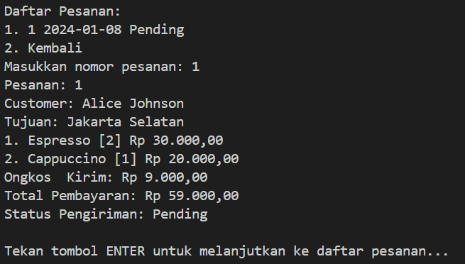

# Coffee Line CLI ☕
## Project Description
Coffee Line is a Command Line Interface (CLI) application for managing an online coffee shop. Developed using Golang and a MySQL database, this application allows both customers and administrators to interact with the system to place orders, manage inventory, and generate reports.

## File Description
- **CLI**: Contains the command-line interface logic. This folder holds all the code related to the CLI commands and their implementation.
- **Entity**: Defines the core entities or models used throughout the application. These structs represent the main data structures that are used and manipulated by the business logic.
- **Config**: Houses the configuration settings for the application. This includes configuration files and code to load these settings, such as environment variables.
- **Handler**: Contains the code responsible for handling requests and responses. This typically includes HTTP handlers, middleware, and other request processing logic.
- **Repository**: Responsible for data access logic. This folder includes code for interacting with databases or other data storage mechanisms.
- **SQL**: Includes the database schema and related SQL scripts. This folder contains ERD, DDL Scripts, and DML Scripts
- **Utils**: Contains utility functions and helper code that are used throughout the application.

## Application Features
### Customer Features
1. **Order Coffee**
    - Customers can place orders for coffee from the available menu.
2. **View Order Status**
    - Customers can check the status of their current and past orders.
3. **Edit User**
    - Customers can update their profile information.
4. **Logout**
    - Ends the customer session.

### Admin Features
1. **Add Product**
    - Allows admins to add new coffee products to the inventory.
2. **Restock Product**
    - Enables admins to restock existing coffee products.
3. **Ship Orders**
    - Allows admins to update the status of orders to 'shipped'.
4. **Popular Product Report**
    - Generates a report of the most popular coffee products.
5. **Product Stock Report**
    - Provides a report on the current stock levels of products.
6. **Loyal Customer Report**
    - Generates a report of the most loyal customers based on their order history.
7. **Logout**
    - Ends the admin session.

## Technology Used
- Golang: For CLI application development.
- MySQL: For database management.
- Railway: For hosting the application and database in the cloud.

## Packaged Used
- **github.com/go-sql-driver/mysql v1.8.1**: MySQL driver for Go.
- **github.com/jedib0t/go-pretty v4.3.0**: Library for pretty-printing tables.
- **github.com/joho/godotenv v1.5.1**: Library for loading environment variables from .env files.
- **golang.org/x/crypto v0.25.0**: Cryptography packages for Go.
- **golang.org/x/term v0.22.0**: Terminal handling packages for Go.

## How to Run
### Local
1. Clone this repository.
2. Copy the `.env.example` file to `.env` and fill in the local database access details.
3. Create the database using the DDL and DML scripts provided in the migrations folder.
4. Run `go run main.go`.

### Example .env File
```DB_HOST=your_database_host
DB_PORT=your_database_port
DB_USER=your_database_user
DB_PASSWORD=your_database_password
DB_NAME=your_database_name
```

## Database Schema
- **Users**: UserID, UserName, Email, Password, Location, RoleID, created_at
- **Products**: ProductID, ProductName, Price, Stock
- **Orders**: OrderID, UserID, PaymentID, ShippingID, Date
- **OrderProduct**: OrderProductID, OrderID, ProductID, Quantity, Status
- **Payments**: PaymentID, PaymentAmount, Date
- **Shipping**: ShippingID, ShippingStatus

### ERD


## Preview Scout Store Admin CLI
### Main Interface

### User's Main Menu

### Orders Menu

### View Orders



### Admin's Main Menu

### Restock Product

### Send Orders

### Report Popular Products

### Report Stock Products

### Report Loyal Customers


## Team Members
- **Driver ([Ahmad Luhur Pakerti](https://github.com/00shiki)):** Writing menu display feature code
- **Navigator ([Mahattir Onassis](https://github.com/igarukas4)):** Reviewing code and providing feedback
- **Observer ([Ghassani Tyas](https://github.com/ghssni)):** Taking notes and documenting features